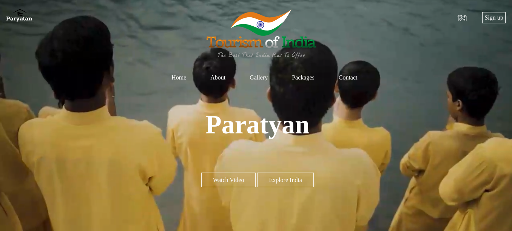
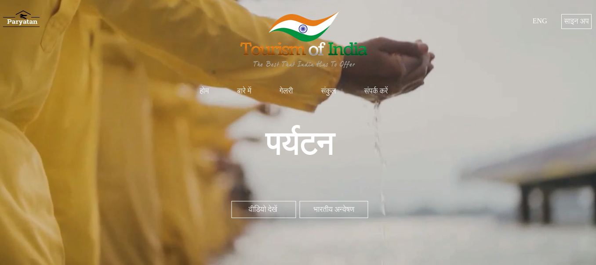

# Paraytan_Tourism_Management

This project's goal is to create a system that streamlines the operations and procedures of a travel business. To correctly design and execute a certain journey is laborious for the consumer. This project was created to replace the present system, which assists in keeping track of client information regarding destination and money received. The highly automated technology under consideration makes traveling considerably more convenient and flexible. Users may obtain the most pertinent information at the most appropriate moment. As a result, the consumer will have more faith in the travel agency.

## How to run
1. Download this repository and extract the file
2. Run '@paraytan.html' file in browser

## Screenshot

